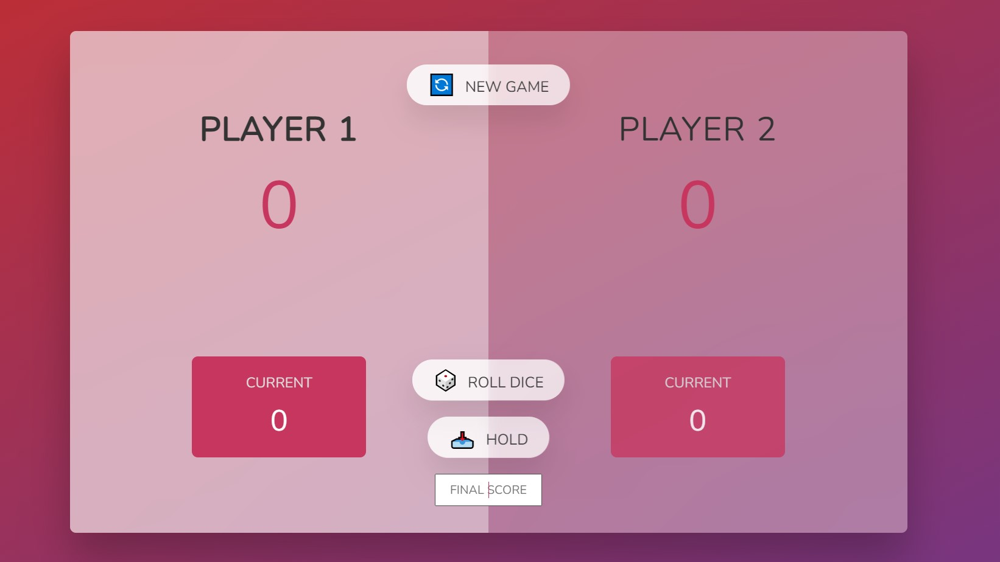

# Pig Game
Pig Game project from The Complete JavaScript Course 2019 Build Real Projects by Jonas Schmedtmann. 
There are two JavaScript files. One contains the major game functions, while the other contains the challenges carried out in the course of this project.



## Built With
- [HTML5](https://developer.mozilla.org/en-US/docs/Web/Guide/HTML/HTML5)
- [CSS](https://developer.mozilla.org/en-US/docs/Web/CSS)
- [JavaScript](https://developer.mozilla.org/en-US/docs/Web/JavaScript)

## Install
```
    $ git clone git@github.com:samiiexx/pig-game.git main
    $ cd main
```

## Contributors
- Favour Samuel (@samiiexx)

## License
Copyright (c) Favour Samuel.

For enquiries please contact us at [sfchidimma@gmail.com](mailto:sfchidimma@gmail.com).
